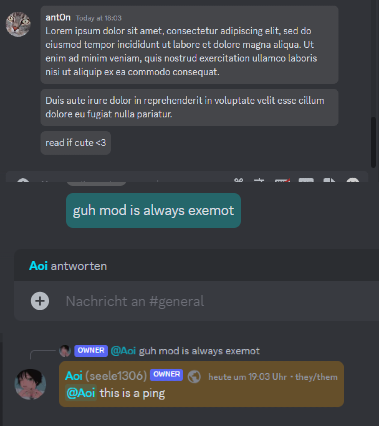
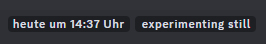
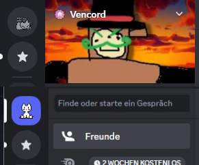
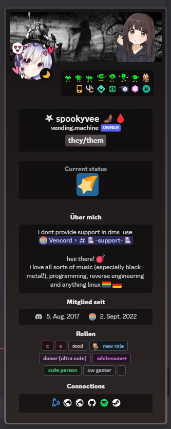

# CSS-Snippets
A compilation of CSS snippets for Discord and its custom clients.

> [!NOTE]
> This is a fork of the original [CSS-Snippets](https://github.com/SEELE1306/CSS-Snippets) which has, unfortunately, been archived. I'll try to keep it up-to-date as I use a few of those snippets myself. I'm not promising anything with my poor Discord's CSS knowledge and time unavailability tho.

> [!CAUTION]
> A [slight maintenance](https://github.com/CichyCze/CSS-Snippets/milestone/1) is going underway. That includes mostly some fixes, documentation edits, and bringing back the removed snippets.
>
> Also, `UserPanel` is currently a bit broken. Fix is planned (see [#1](../../issues/1)).

> [!WARNING]
> Because of a major revamp of the user profiles in the mid-2024, the original author decided to temporatily remove the `BetterProfiles` and `UserOptions` snippets. Their return is planned (see [#2](../../issues/2), [#3](../../issues/3) and [#4](../../issues/4)).

## List of available snippets
| Snippet | Description | Image |
| -------- | ------- | ------- |
| [BetterQuotes](Snippets/BetterQuotes/) | Improves blockquotes styling to make them more visible and appealing. |  |
| [AccentColor](Snippets/ChangeColor/AccentColor/) | Replaces the Blurple [#5865F2] accent color with one of your choice. |  |
| [ClientColor](Snippets/ChangeColor/ClientColor/) | Replaces the Grey [#313338] client color with one of your choice. |  |
| [OtherColors](Snippets/ChangeColor/OtherColors/) | Replaces other Discord colors (red, yellow, green, etc.) with Blurple [#5865F2].|  |
| [ChannelSelections](Snippets/ChannelSelections/) | Adds more spacing between the channel icons and colored unread notifiers. |  |
| [ChatBubbles](Snippets/ChatBubbles/) | Wraps messages inside chat bubbles. Also, different colors for normal, reply, mention and automod messages are available. |  |
| [GuildBoost](Snippets/GuildBoost/) | Replaces the guild boost bar with a more appealing one. |  |
| [MessageSection-v2](Snippets/MessageSection/v2/) | Makes the unread messages elements more appealing. |  |
| [MessageTypes](Snippets/MessageUltilities/MessageTypes/) | Adds text descriptions to messages based on the action. Currently available in `Czech`, `English` and `German`. |  |
| [TimestampBubbles](Snippets/MessageUltilities/TimestampBubbles/) | Applies a bubble styling to the message timestamps. |  |
| [Username](Snippets/MessageUltilities/Username/) | Applies a bubble to the usernames that abide by role color. |  |
| [OnekoDM](Snippets/OnekoDM/) | Replaces the discord logo with Oneko! |  |
| [UserPanel](Snippets/UserPanel/) | Replaces the user panel with a customizable and more appealing version. |  |
| [ToolbarHide](Snippets/ToolbarHide/) | Hides the top toolbar for a cleaner layout. |  |
| [StaffTags](Snippets/StaffTags/) | Applies styling to different staff tags for easier identification. |  |
| [Titlebar](Snippets/Titlebar/) | Changes the default Discord titlebar to a more visually appealing one. Text and background color is customizable. |   |
| [SpotifyControls](Snippets/SpotifyControls/) | Redesigns the Spotify Controls. |  |

## List of temporarily unavailable snippets
| Snippet | Description | Image |
| -------- | ------- | ------- |
| BetterProfiles | Improves general layout of user profiles, improving readability and visual appeal. Credits to [Saltssaumure](https://github.com/Saltssaumure) for the role pills. |  |
| GuildList | Makes the guild/server list more more efficient and more appealing. |  |
| UserOptions | Replaces the profile popout with more streamlined options |  |

## Apply
There are several methods to apply these snippets. The methods below are for Vencord, however other clients have similar methods.

The `import.css` might not work properly on a client other than [Vesktop](https://github.com/Vencord/Vesktop). In case of issues, try using the `import-legacy.css`, if available.

### Methods

QuickCSS

1. Navigate to the snippet you'd like to use. There should be an `import.css` file present.
2. Click on the file and once it's loaded, click the `Raw` button.
3. Once the file opens in your browser, copy the URL.
4. On your Vencord client, open `Settings` > `Vencord` > `Edit QuickCSS`.
5. On top of your QuickCSS, put `@import url(URL OF THE FILE);`. The client should automatically apply the theme.

Online Themes

1. Navigate to the snippet you'd like to use. There should be an `import.css` file present.
2. Click on the file and once it's loaded, click the `Raw` button.
3. Once the file opens in your browser, copy the URL.
4. On your Vencord client, open `Settings` > `Themes` > `Online Themes`.
5. Inside the text box, paste the URL you coppied in step 3.
6. Click outside the text box for the theme to apply.

Local Themes

1. Navigate to the snippet you'd like to use. There should be an `import.css` file present.
2. Click on the file and once it's loaded, download the file via the `Download raw file` button.
3. On your Vencord client, open `Settings` > `Themes` > `Local Themes` > `Open Themes Folder`.
4. Once the folder opens, put the downloaded file inside. The client should automatically apply the theme.

## Special thanks to

- [Aoi](https://github.com/SEELE1306) for creating these lovely snippets ❤️
+ [ant0n-0x0000](https://github.com/ant0n-0x0000) for helping out with the snippets' descriptions!
+ [Saltssaumure](https://github.com/Saltssaumure), [Lexia](https://github.com/exterpolation), [UzinSG](https://github.com/UzinSG) for various elements within the snippets!